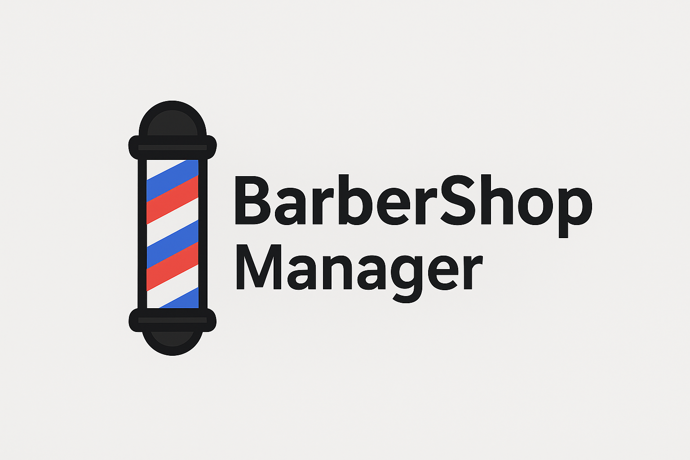
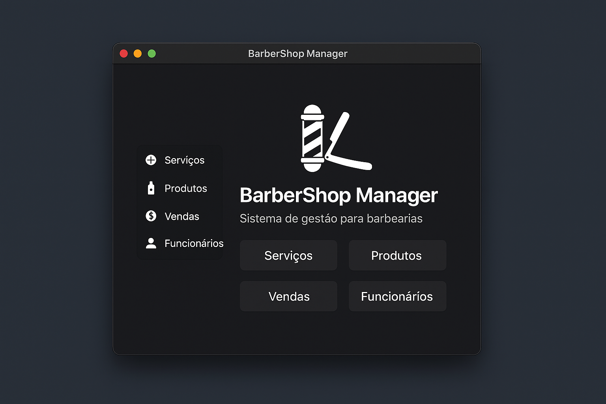

# 💈 BarberShop Manager  
Sistema de Gestão para Barbearias em Python


---

<p align="center">
  
</p>

## ✂️ Sobre o Projeto
O **BarberShop Manager** é um sistema criado em Python para auxiliar barbearias no controle diário de:

- 📌 *Serviços* (cadastro, edição e remoção)  
- 🧴 *Produtos* e estoque  
- 💵 *Vendas*  
- 👤 *Funcionários*  
- 🧮 Cálculo automático de totais  
- 📊 Interface simples e prática

Ideal para pequenos estabelecimentos que precisam organizar seu fluxo de atendimento e produtos sem complicação.

<p align="center">
  
</p>

---

## 🛠 Tecnologias Utilizadas
- Python 3.x  
- Tkinter (UI)  
- JSON / SQLite (dependendo da versão final)  
- Estrutura modular  

---

## 🚀 Como Rodar o Projeto
```bash
git clone https://github.com/ThiagoSPaixao/barbershop-manager
cd barbershop-manager
python main.py
```
---

📚 Funcionalidades

Cadastro de serviços com preço

Controle de produtos e estoque

Registro de vendas

Painel com totais e histórico

Sistema de confirmação para exclusões

Módulo simples de funcionários

---

🗂 Estrutura do Projeto (exemplo)
```bash
/barbershop-manager
 └── main.py
 └── services/
 └── products/
 └── employees/
 └── sales/
 └── data/
```
---
🤝 Contribuições

Sinta-se à vontade para abrir issues e enviar pull requests.
